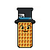

Background GIF by [Aliciel](https://www.pinterest.com/pin/5277724550564022/) on [Pinterest](https://www.pinterest.com/).

 &nbsp;
 &nbsp;

### Hi there, I'm Vania 👋
 &nbsp;

- 🔭 I’m currently learning about how to create amazing games
- 👯 I’m looking to collaborate on projects that provide the "wow effect" to the user
- 💬 Ask me about VR and AR, we will became best friends!

## 💻 My tech stack:

  

## 👾 For personal projects:

  

## 💡A quote:

## 🏆 My Stats:

    &nbsp;&nbsp;

<!--
**vaffer94/vaffer94** is a ✨ _special_ ✨ repository because its `README.md` (this file) appears on your GitHub profile.

Here are some ideas to get you started:

- 🔭 I’m currently working on ...
- 🌱 I’m currently learning ...
- 👯 I’m looking to collaborate on ...
- 🤔 I’m looking for help with ...
- 💬 Ask me about ...
- 📫 How to reach me: ...
- 😄 Pronouns: ...
- ⚡ Fun fact: ...
-->
